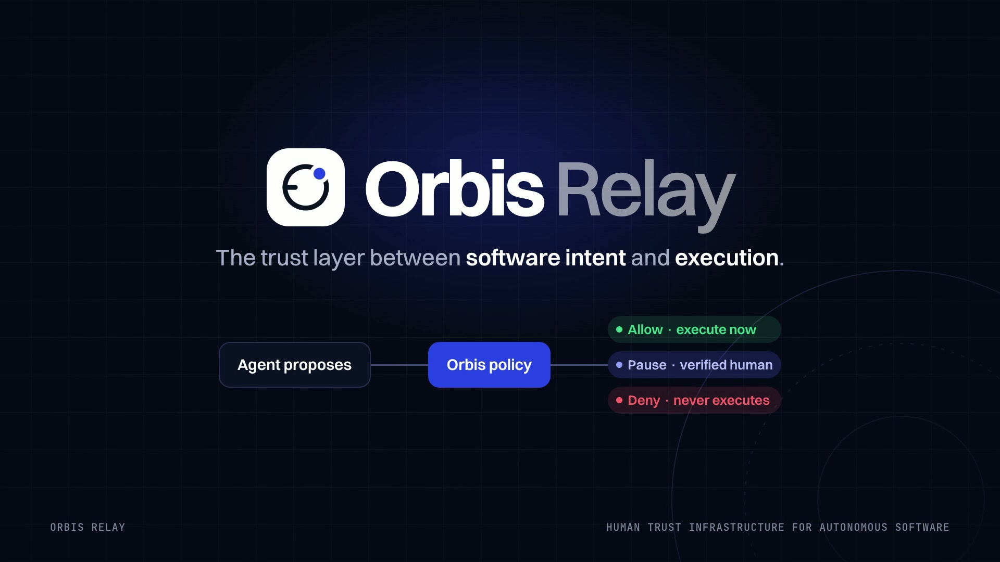

# Orbis Relay

**Human trust infrastructure for autonomous software.** Before an AI agent, workflow or internal tool does something risky, it asks Orbis. Deterministic policy decides in milliseconds; high-impact actions pause on a verified human's iPhone with evidence, Face ID and a safe alternative; every decision returns an Ed25519-signed receipt.

> Control without killing autonomy.



This repository is a portfolio-grade build of the *Orbis Relay Master Product Build Blueprint*: a marketing site, a full admin console, a demo customer app, a gateway API with seeded demo data, TypeScript and Python SDKs, a native SwiftUI iOS app, two ML models trained from scratch, and a 40-second launch film.

## Quick start

Requirements: Node 22+, pnpm 11, Python 3.11 + numpy (only to retrain models), Xcode 26+ (only for iOS), FFmpeg (only for the film).

```bash
pnpm install
pnpm dev                       # http://localhost:4310
```

| URL | What it is |
|---|---|
| `/` | Marketing site — live policy engine in the hero, interactive playground, iPhone demo, receipt verifier, “Is this safe?”, launch film |
| `/demo` | **Northstar Cloud ops console** — the fictional customer app. Run an agent scenario and watch it pause, get approved on the embedded iPhone, and resume |
| `/console` | Orbis web console (sign in with any demo persona) |
| `/docs` | Quickstart, concepts, API reference |
| `/verify` | Paste any exported receipt and verify it in your browser |
| `/api/v1/openapi` | OpenAPI 3.1 contract (also in `docs/api/openapi.json`) |

The demo tenant (Northstar Cloud: 12 people, 12 integrations, 13 actors, 10 policies, ~1,200 decisions over 28 days, 10 pending approvals, an active freeze) is generated on first run by the *real* gateway services and re-seeds automatically after 20 hours. Reset any time from the console account menu or `pnpm demo:reset`.

### The 3-minute demo

1. Open `/demo`, pick **AI agent → external model**, press **Run agent**. The procurement agent calls `orbis.preflight()`; policy pauses it (risk 65, *Confidential data egress v17*).
2. On the embedded approver iPhone, sign in as the approver and tap **Redirect safely**. Face ID runs, the agent re-plans onto `northstar-private-llm`, executes, and reports the outcome.
3. Click the receipt link → the console receipt viewer verifies the Ed25519 signature in your browser. Press **Tamper with a field** and watch verification fail.
4. Try **Emergency freeze drill**: the ops agent loops, you freeze it, and the next gateway call returns `deny · frozen`.
5. In `/console/policies/pol_conf_external`, open draft v18 → **Simulate against history** → see exactly which past decisions change → co-sign & publish. The gateway enforces it immediately.

## What's in the box

```
apps/
  web/                 Next.js 16 — marketing site, console, demo customer app, /api/v1 gateway
  ios/                 Orbis iOS — SwiftUI app + XCTest suite (Xcode project, synchronized folders)
packages/
  policy-core/         Deterministic, versioned policy engine + risk scoring (pure TS, no I/O)
  ts-sdk/              @orbis/sdk — preflight, waitForResolution, outcomes, receipts, webhooks, agent adapter
  python-sdk/          orbis_relay — stdlib-only Python SDK
ml/                    From-scratch models (numpy only) + training data download notes
video/brag-output/     Hyperframes launch film (plan, brief, composition, render)
fixtures/              Default policy pack + golden decision fixtures (policy regression)
docs/                  ADR, threat model, OpenAPI
```

### Gateway API (demo backend)
The blueprint's production stack is FastAPI + PostgreSQL + Temporal. Per this build's scope the backend is deliberately small: Next.js route handlers over an in-memory store persisted to `apps/web/.data/store.json`. Everything a reviewer can touch is real behaviour, not mocks:

- `POST /v1/decisions/preflight` → typed envelope validation, idempotency (`request_id` / `Idempotency-Key`), deterministic evaluation, routing, TTL, step-up, quorum.
- Approval lifecycle with server-side checks (assignment, tenant, state, expiry, one response per user, step-up proof, editable-field bounds), 50%-TTL escalation, expiry, cancellation.
- Ed25519 receipts with revision chains; `POST /v1/receipts/:id/verify`; public JWK.
- Hash-chained audit trail with `GET /v1/audit/verify`.
- Freeze / unfreeze, policy drafts, simulator, two-person publish, webhook test with SSRF rules, Server-Sent Events for live UI.

See `docs/architecture/ADR-001-tenancy-auth-decision-lifecycle.md` and `docs/threat-model/threat-model.md`.

### Console
Overview · Actions (filter, sort, CSV, trust-timeline inspector) · Approvals (queues, SLA, quorum, passkey step-up, edit & approve, safe alternatives) · Policies (rules, version diff, editor, simulator, publish) · Integrations (keys, webhook health, activation time) · Agents & Actors (baselines, freeze) · Audit (chain verification, JSONL export) · Analytics (north-star metrics from real events) · Protect · Developer (quickstarts, sandbox, request inspector, key creation, webhook tester) · Settings (RBAC matrix, retention, SSO/SCIM, devices, usage). A live **iPhone twin** docks on the right of every page.

### Orbis iOS
Native SwiftUI, Swift Concurrency, `@Observable`, Keychain (`WhenUnlockedThisDeviceOnly`), LocalAuthentication step-up, Universal-style deep links (`orbis://approval/<id>`, strictly validated), local notifications carrying only title + risk, app-switcher privacy shield, MDM managed-config hook, offline fixture mode, Vision OCR for screenshots and a VisionKit QR scanner.

```bash
pnpm ios:test                  # 16 XCTest cases: expiry, already-resolved, Face ID cancel/fail,
                               # double submit, edit validation, unauthorized/tenant deep links, decoding
open apps/ios/OrbisRelay.xcodeproj   # run on a simulator; server URL defaults to http://localhost:4310
```
The simulator shares the Mac's network, so the app talks to the same live gateway as the website. Simulators without enrolled Face ID fall back to a simulated confirmation (Features ▸ Face ID ▸ Enrolled exercises the real path). APNs, App Attest and real-device Face ID need a signed device build.

### Machine learning (from scratch, no AI APIs)
| Model | Data | Method | Held-out test |
|---|---|---|---|
| `orbis-protect-hostname-lr` | [PhiUSIIL Phishing URL](https://archive.ics.uci.edu/dataset/967/phiusiil+phishing+url+dataset) (CC BY 4.0) + Tranco top 60k | Logistic regression on 16 lexical features + 65,536 hashed char 3-5-grams, full-batch Adam, numpy only | ROC-AUC 0.908 · precision 0.861 · F1 0.792 (54k hosts) |
| `orbis-protect-message-nb` | [UCI SMS Spam Collection](https://archive.ics.uci.edu/dataset/228/sms+spam+collection) (CC BY 4.0) | Multinomial Naive Bayes, Laplace smoothing | ROC-AUC 0.985 · F1 0.954 (1,115 msgs) |

PhiUSIIL's legitimate URLs are all bare `https://www.` homepages, so a naive model learns “has a path ⇒ phishing”. The URL model is trained on the normalized hostname only, and path signals are handled by explainable rules. Python and TypeScript feature extraction are parity-tested to 1e-6 on 88 fixtures. Model scores are advisory: they power Protect's explanations and never enforce policy. Retrain with `pnpm ml:train` (see `ml/README.md`).

### SDKs
```ts
const decision = await orbis.preflight({ actor, action, resources, destination, intent });
if (decision.isAllowed()) await execute();
else if (decision.requiresApproval()) {
  const final = await decision.waitForResolution({ timeoutMs: 600_000 });
  if (final.approved) await execute(final.approvedParameters);
}
await orbis.reportOutcome(decision.actionId, "succeeded");
```
The SDKs never execute your action, and API keys live in ES private fields, so serializing a decision can't leak them. `createAgentAdapter` wraps agent tool calls and throws `ToolBlockedError` on denials.

## Tests

```bash
pnpm test        # policy-core (26: unit + 17 golden fixtures) + web (94: ML parity, seed invariants, every receipt signature, audit chain)
pnpm test:sdk    # TS SDK (5) + Python SDK (6) against the running gateway
pnpm ios:test    # iOS (16)
pnpm typecheck && pnpm lint && pnpm build
```

CI: `docs/ci/github-actions-ci.yml` runs all of the above plus the iOS suite on macOS. To enable it, copy it to `.github/workflows/ci.yml` (pushing workflow files needs a token with the `workflow` scope: `gh auth refresh -s workflow`).

## Launch film
`apps/web/public/media/orbis-launch.mp4` (40 s, 1080p, Kokoro voiceover, beat-locked to the music bed) was made with Hyperframes from `video/brag-output/composition/index.html`. Re-render with `pnpm video`. The plan, brief and share copy are in `video/brag-output/`.

## What's simulated
- Persistence is a JSON document, not PostgreSQL; expiry/escalation runs on an in-process timer, not Temporal.
- Webhook deliveries are recorded, not sent. SSO is demo personas.
- Web step-up is a simulated passkey prompt; iOS uses real LocalAuthentication.
- All organizations, people, vendors and figures are fictional. “Orbis Relay” is a working name.

## Credits
Music: “Happy Beats / Business Moves vol. 12” by ende.app. SFX: Kenney.nl (CC0). Fonts: Switzer (Fontshare), Instrument Serif and JetBrains Mono (OFL). Datasets: UCI ML Repository (CC BY 4.0) and the Tranco list.
