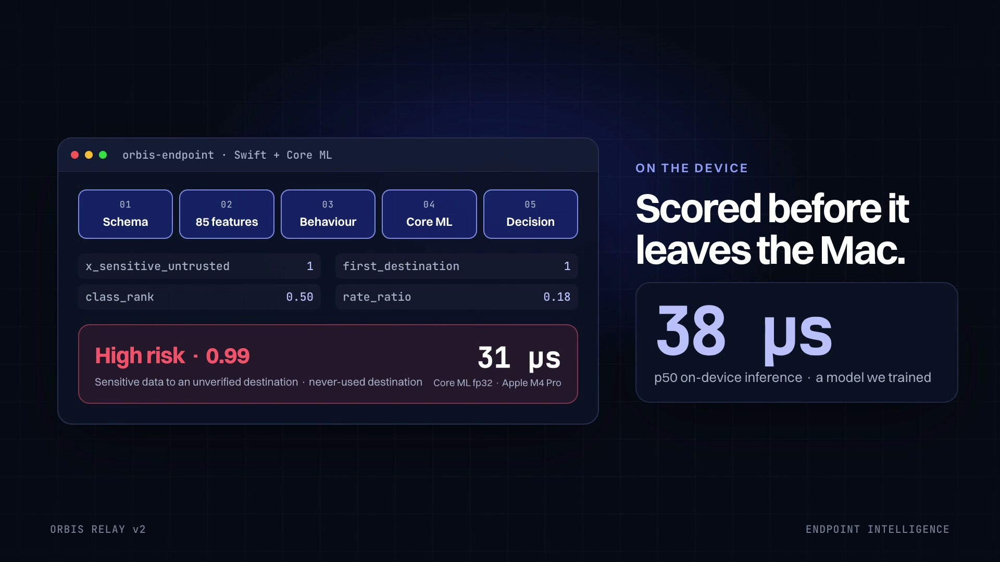

# Orbis Relay

**Human trust infrastructure for autonomous software, now with endpoint intelligence.** Before an AI agent, workflow or internal tool does something risky, it asks Orbis. Deterministic tenant policy decides in milliseconds. A compact risk model, trained in this repo and running on the Mac with Core ML, adds a calibrated local signal. That signal can *raise* an action to a human but never lower one. High-impact actions pause on a verified human's iPhone with plain-language evidence, Face ID and a safe alternative. Every decision returns an Ed25519-signed receipt that records the policy version, feature schema, model version and outcome.

> Control without killing autonomy. The model can ask for a human. It can never approve.

**Live demo → [orbis-relay.vercel.app](https://orbis-relay.vercel.app)** · [Console → Intelligence](https://orbis-relay.vercel.app/console/intelligence) · [Northstar demo app](https://orbis-relay.vercel.app/demo) · [Docs](https://orbis-relay.vercel.app/docs)

[](apps/web/public/media/orbis-launch-v2.mp4)

## v2 — Orbis Endpoint Intelligence

```
 agent / app ──▶ orbis-endpoint (Swift, macOS)                    Orbis gateway (Next.js)
                 event → schema → features → Core ML ──signal──▶  policy (deterministic, final)
                 anomaly · bounded state · telemetry              + cloud score (TS port) ─▶ fuse(): can only raise
                 signed-manifest model manager ◀── manifest ──── model control plane (registry, gates, rollout)
                                                                         │
 ml/ (Python): dataset → features → baselines → eval → gates ─▶ registry ┘   iPhone: evidence + Face ID → signed receipt
               → Core ML/ONNX + parity → drift → review → retrain (never auto-promotes)
```

**Model evaluation** for `orbis-edge-risk` 1.0.0 (production), a 3,348-parameter MLP. It was trained on `northstar-actions@1.0.0`: 33,274 synthetic events, time- and actor-held-out splits, and a hand-authored gold set.

| | Test (5,442 events) | Gold set (90 gated) |
|---|---|---|
| Suspicious + high-risk escalation recall | 98.0% | 100% |
| High-risk escalation recall | 91.2%¹ | 100% |
| False-escalation rate (safe → review) | 0.24% | hard-negative FPR 0% |
| Mean security cost · macro-F1 · ECE | 0.0732 · 0.928 · 0.0146 | — |

¹ Mostly the test-only *disguised classification* template, a documented limitation of metadata-only models. Full detail: [`docs/ml/evaluation.md`](docs/ml/evaluation.md) and the [model card](ml/models/risk_classifier/1.0.0/MODEL_CARD.md).

**Endpoint benchmark** measured on an Apple M4 Pro, Core ML FP32, batch 1. Details in [`docs/ml/benchmarks.md`](docs/ml/benchmarks.md).

| Cold load | Warm p50 / p95 | Event → signal pipeline p95 | Model memory | Sustained 10 min @ 50 events/s |
|---|---|---|---|---|
| 47.6 ms | 38 µs / 57 µs | 63 µs | +6.6 MB (21 MB process peak) | 2.5% of one core, 0 failures |

**What's proven, and where:**
- **Training and selection.** Rule baseline, logistic regression, HistGB and MLPs are compared on a security cost matrix; selection uses validation only. → [`baselines_report.md`](ml/models/risk_classifier/baselines_report.md)
- **Reproducibility.** The dataset regenerates hash-identical from its manifest; retraining gives bit-identical weights; every run is in MLflow. → `pnpm ml reproduce`
- **Release gates.** 17 machine-checked gates (gold recall, false-positive budget, calibration, parity, latency, memory, adversarial, slice regression, model card). 1.0.0 passes 19/19 checks. Candidate 1.1.0 is **blocked**: it fixes a red-team finding and cuts cost on the new production window 12×, but regresses two golden scenarios.
- **Parity across four runtimes.** Python ↔ Core ML (4e-7) ↔ ONNX (5e-7) ↔ TypeScript (1e-9) ↔ Swift (1e-9). C++20 matches all 33,274 dataset vectors, 93% bit-identical.
- **Signed cloud→endpoint distribution.** Ed25519 manifests, sha256-checked artifacts, monotonic sequence (replay/downgrade-proof), compile + smoke test, atomic activation, local and fleet rollback, kill switch.
- **Operating the model.** Drift (PSI per 7-day window), an active-review queue, label states with confidence, feedback export, and a retraining pipeline that ends at *candidate*.
- **Security evaluation.** 12/12 required adversarial cases (evasion, OOD, poisoning, prompt-text invariance), with the attacks that succeed documented. → [`docs/threat-model`](docs/threat-model/threat-model.md)

### Run the ML lifecycle and the endpoint
```bash
python3 -m venv ml/.venv && ml/.venv/bin/pip install -r ml/requirements.lock
ml/pipeline.sh                                   # ~70 s: dataset → train → convert → reproduce → adversarial → retrain → gates → export
pnpm endpoint:test                               # 25 Swift tests: parity, manifest security, rollback, fallbacks
pnpm endpoint:bench                              # measure on your Mac
pnpm cxx:test                                    # C++20 parity + ASan/UBSan
pnpm dev                                         # gateway + console on :4310, then:
cd apps/macos-endpoint && .build/release/orbis-endpoint sync --gateway http://localhost:4310 \
  --key orb_live_np_procure_5f8c2a91d7e4b603aa71 --endpoint-id ep_my_mac
.build/release/orbis-endpoint replay ../../fixtures/endpoint-events/hero.jsonl \
  --gateway http://localhost:4310 --key orb_live_np_procure_5f8c2a91d7e4b603aa71 --preflight
```
The `sync` step verifies the signed manifest, checks the artifact hash, compiles the model in about 26 ms, smoke-tests it and activates it atomically. `replay` then scores the hero exfiltration attempt locally in about 31 µs, and the gateway attaches that signal to the approval on the iPhone.

Design records: [ADR-002 endpoint intelligence](docs/architecture/ADR-002-endpoint-intelligence.md) · [ADR-003 model & runtimes](docs/architecture/ADR-003-edge-model-and-runtimes.md) · [ADR-004 MLOps plane](docs/architecture/ADR-004-mlops-plane.md) · [dataset card](docs/ml/dataset.md) · [drift & ground truth](docs/ml/drift.md) · [runbook](docs/runbooks/model-rollback.md) · [5-minute demo](docs/demos/demo-script.md) · [deep-dive Q&A](docs/ml/deep-dive.md)

### Known limitations (v2)
- All training and evaluation data is synthetic. Real-tenant performance is unknown until shadow mode collects reviewed labels.
- A metadata-only model can't see through misstated classification (secret material labelled `internal`) or an agent-asserted ticket flag (fixed in candidate 1.1.0, which is gate-blocked for other reasons). Deterministic thresholds stay authoritative for exactly this reason.
- Slow ramps (+10%/day) are absorbed by per-actor baselines.
- The 23-endpoint demo fleet is simulated from measured benchmarks; real `orbis-endpoint` processes register alongside it and are labelled *real*.
- Energy was not measured (it needs `powermetrics` or Instruments); CPU time is reported as the proxy. MLX was not built (out of scope at this model size).

## Quick start

Requirements: Node 22+, pnpm 11, Python 3.11 + numpy (only to retrain models), Xcode 26+ (only for iOS), FFmpeg (only for the film).

```bash
pnpm install
pnpm dev                       # http://localhost:4310
```

| URL | What it is |
|---|---|
| `/` | Marketing site — live policy engine in the hero, interactive playground, iPhone demo, receipt verifier, “Is this safe?”, launch film |
| `/demo` | **Northstar Cloud ops console** — the fictional customer app. Run an agent scenario and watch it pause, get approved on the embedded iPhone, and resume |
| `/console` | Orbis web console (sign in with any demo persona) |
| `/docs` | Quickstart, concepts, API reference |
| `/verify` | Paste any exported receipt and verify it in your browser |
| `/api/v1/openapi` | OpenAPI 3.1 contract (also in `docs/api/openapi.json`) |

The demo tenant (Northstar Cloud: 12 people, 12 integrations, 13 actors, 10 policies, ~1,200 decisions over 28 days, 10 pending approvals, an active freeze) is generated on first run by the *real* gateway services and re-seeds automatically after 20 hours. Reset any time from the console account menu or `pnpm demo:reset`.

### The 3-minute demo

1. Open `/demo`, pick **AI agent → external model**, press **Run agent**. The procurement agent calls `orbis.preflight()`; policy pauses it (risk 65, *Confidential data egress v17*).
2. On the embedded approver iPhone, sign in as the approver and tap **Redirect safely**. Face ID runs, the agent re-plans onto `northstar-private-llm`, executes, and reports the outcome.
3. Click the receipt link → the console receipt viewer verifies the Ed25519 signature in your browser. Press **Tamper with a field** and watch verification fail.
4. Try **Emergency freeze drill**: the ops agent loops, you freeze it, and the next gateway call returns `deny · frozen`.
5. In `/console/policies/pol_conf_external`, open draft v18 → **Simulate against history** → see exactly which past decisions change → co-sign & publish. The gateway enforces it immediately.

## What's in the box

```
apps/
  web/                 Next.js 16 — marketing site, console (+ Intelligence), demo customer app, /api/v1 gateway
  ios/                 Orbis iOS — SwiftUI app + XCTest suite (Xcode project, synchronized folders)
  macos-endpoint/      v2 Swift endpoint runtime: features, Core ML, signed model manager, telemetry, bench CLI
packages/
  policy-core/         Deterministic, versioned policy engine + risk scoring + policy/ML fusion (pure TS, no I/O)
  cxx-risk-core/       v2 C++20 port of the feature calculator (parity + sanitizers)
  ts-sdk/              @orbis/sdk — preflight, waitForResolution, outcomes, receipts, webhooks, agent adapter
  python-sdk/          orbis_relay — stdlib-only Python SDK
ml/                    v1 Protect models (numpy) + v2 orbis_ml lifecycle (dataset, train, eval, gates, convert, drift, retrain)
video/brag-output/     Hyperframes launch film (plan, brief, composition, render)
fixtures/              Policy pack, golden decisions, endpoint event schema/streams, cross-language parity fixtures
docs/                  ADR, threat model, OpenAPI
```

### Gateway API (demo backend)
The blueprint's production stack is FastAPI + PostgreSQL + Temporal. Per this build's scope the backend is deliberately small: Next.js route handlers over an in-memory store persisted to `apps/web/.data/store.json`. Everything a reviewer can touch is real behaviour, not mocks:

- `POST /v1/decisions/preflight` → typed envelope validation, idempotency (`request_id` / `Idempotency-Key`), deterministic evaluation, routing, TTL, step-up, quorum.
- Approval lifecycle with server-side checks (assignment, tenant, state, expiry, one response per user, step-up proof, editable-field bounds), 50%-TTL escalation, expiry, cancellation.
- Ed25519 receipts with revision chains; `POST /v1/receipts/:id/verify`; public JWK.
- Hash-chained audit trail with `GET /v1/audit/verify`.
- Freeze / unfreeze, policy drafts, simulator, two-person publish, webhook test with SSRF rules, Server-Sent Events for live UI.

See `docs/architecture/ADR-001-tenancy-auth-decision-lifecycle.md` and `docs/threat-model/threat-model.md`.

### Console
Overview · Actions (filter, sort, CSV, trust-timeline inspector) · Approvals (queues, SLA, quorum, passkey step-up, edit & approve, safe alternatives) · Policies (rules, version diff, editor, simulator, publish) · Integrations (keys, webhook health, activation time) · Agents & Actors (baselines, freeze) · Audit (chain verification, JSONL export) · Analytics (north-star metrics from real events) · Protect · Developer (quickstarts, sandbox, request inspector, key creation, webhook tester) · Settings (RBAC matrix, retention, SSO/SCIM, devices, usage). A live **iPhone twin** docks on the right of every page.

### Orbis iOS
Native SwiftUI, Swift Concurrency, `@Observable`, Keychain (`WhenUnlockedThisDeviceOnly`), LocalAuthentication step-up, Universal-style deep links (`orbis://approval/<id>`, strictly validated), local notifications carrying only title + risk, app-switcher privacy shield, MDM managed-config hook, offline fixture mode, Vision OCR for screenshots and a VisionKit QR scanner.

```bash
pnpm ios:test                  # 16 XCTest cases: expiry, already-resolved, Face ID cancel/fail,
                               # double submit, edit validation, unauthorized/tenant deep links, decoding
open apps/ios/OrbisRelay.xcodeproj   # run on a simulator; server URL defaults to http://localhost:4310
```
The simulator shares the Mac's network, so the app talks to the same live gateway as the website. Simulators without enrolled Face ID fall back to a simulated confirmation (Features ▸ Face ID ▸ Enrolled exercises the real path). APNs, App Attest and real-device Face ID need a signed device build.

### Machine learning (from scratch, no AI APIs)
| Model | Data | Method | Held-out test |
|---|---|---|---|
| `orbis-protect-hostname-lr` | [PhiUSIIL Phishing URL](https://archive.ics.uci.edu/dataset/967/phiusiil+phishing+url+dataset) (CC BY 4.0) + Tranco top 60k | Logistic regression on 16 lexical features + 65,536 hashed char 3-5-grams, full-batch Adam, numpy only | ROC-AUC 0.908 · precision 0.861 · F1 0.792 (54k hosts) |
| `orbis-protect-message-nb` | [UCI SMS Spam Collection](https://archive.ics.uci.edu/dataset/228/sms+spam+collection) (CC BY 4.0) | Multinomial Naive Bayes, Laplace smoothing | ROC-AUC 0.985 · F1 0.954 (1,115 msgs) |

PhiUSIIL's legitimate URLs are all bare `https://www.` homepages, so a naive model learns “has a path ⇒ phishing”. The URL model is trained on the normalized hostname only, and path signals are handled by explainable rules. Python and TypeScript feature extraction are parity-tested to 1e-6 on 88 fixtures. Model scores are advisory: they power Protect's explanations and never enforce policy. Retrain with `pnpm ml:train` (see `ml/README.md`).

### SDKs
```ts
const decision = await orbis.preflight({ actor, action, resources, destination, intent });
if (decision.isAllowed()) await execute();
else if (decision.requiresApproval()) {
  const final = await decision.waitForResolution({ timeoutMs: 600_000 });
  if (final.approved) await execute(final.approvedParameters);
}
await orbis.reportOutcome(decision.actionId, "succeeded");
```
The SDKs never execute your action, and API keys live in ES private fields, so serializing a decision can't leak them. `createAgentAdapter` wraps agent tool calls and throws `ToolBlockedError` on denials.

## Tests

```bash
pnpm test           # policy-core 34 (unit + golden + policy/ML fusion) · web 137 (Protect + edge-model parity Python↔TS,
                    #   seed determinism, receipts, audit chain, model control plane: gates block, rollback, auto-rollback, kill switch)
pnpm test:sdk       # TS SDK (5) + Python SDK (6) against the running gateway
pnpm ios:test       # iOS (18) incl. edge-risk evidence decoding
pnpm endpoint:test  # macOS endpoint (25): feature/model parity, signed manifests, tamper/replay/expiry, rollback, fallbacks, telemetry
pnpm cxx:test       # C++20 feature calculator parity + ASan/UBSan
pnpm ml:gates       # release gates for orbis-edge-risk 1.0.0 (exit 1 on any failure)
pnpm typecheck && pnpm lint && pnpm build
```

CI (`.github/workflows/ci.yml`): web tests, typecheck, lint, build and SDK integration on Ubuntu; C++ parity with sanitizers; and on macOS the ML reproducibility check, conversion parity, adversarial suite and **release gates**, the Swift endpoint suite and the iOS suite.

## Launch film
`apps/web/public/media/orbis-launch-v2.mp4` (43.5 s, 1080p, Kokoro voiceover, beat-locked to the music bed, audio-reactive glow) covers v2: on-device scoring, the "model can only raise" rule, the iPhone edge-risk card and the release gate that blocked our own retrained model. It was made with Hyperframes from `video/brag-output-2026-10-06-084320/composition/index.html`; re-render with `pnpm video`. The original v1 film (`orbis-launch.mp4`, 40 s) is still published and re-renders with `pnpm video:v1`. Each film's plan, brief and share copy sit next to its composition.

## Deployment (Vercel)

The demo runs on Vercel serverless functions, where requests can land on different instances. Three things keep every instance consistent without a database:

1. **Deterministic seed.** The tenant is rebuilt from a seeded PRNG, seeded ids and an Ed25519 key derived from `ORBIS_SIGNING_SEED`, so every instance holds byte-identical data and any receipt verifies anywhere.
2. **Shared op log.** Every mutation is an `Op` (`apps/web/src/lib/server/ops.ts`) applied with ids derived from the op and its recorded timestamp, then appended to a private **Vercel Blob** log (`sync.ts`). Before serving, an instance replays the ops it hasn't seen. A shared *epoch* pins the seed time; a demo reset starts a new epoch.
3. **Stateless sessions.** Console cookies and iOS tokens are HMAC-signed claims (`ORBIS_SESSION_SECRET`), so they verify on any instance.

Tests cover both properties: two replicas replaying one log converge byte-for-byte (`replica.test.ts`), and two seeds with the same anchor are identical (`seed.test.ts`). Locally, without `BLOB_READ_WRITE_TOKEN`, the single process is the source of truth and data persists to `apps/web/.data/`.

Project settings: Root Directory `apps/web`, framework Next.js, region `iad1`, Fluid compute. Env: `ORBIS_SIGNING_SEED`, `ORBIS_SESSION_SECRET`, `BLOB_READ_WRITE_TOKEN` (from the connected Blob store).

## What's simulated
- Persistence is a deterministic seed plus a Blob op log (or a local JSON file), not PostgreSQL; expiry/escalation is computed on request, not by Temporal.
- Webhook deliveries are recorded, not sent. SSO is demo personas.
- Web step-up is a simulated passkey prompt; iOS uses real LocalAuthentication.
- All organizations, people, vendors and figures are fictional. “Orbis Relay” is a working name.

## Credits
Music: “Happy Beats / Business Moves vol. 12” by ende.app. SFX: Kenney.nl (CC0). Fonts: Switzer (Fontshare), Instrument Serif and JetBrains Mono (OFL). Datasets: UCI ML Repository (CC BY 4.0) and the Tranco list.
